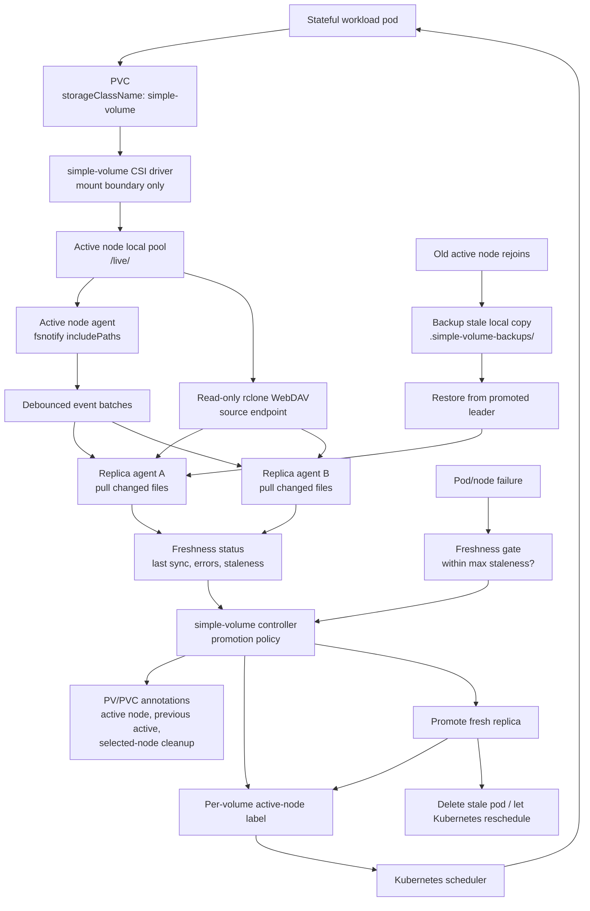

# Why simple-volume Exists

`simple-volume` exists because the workloads we care about need a narrow
Kubernetes-local storage behavior that existing storage products do not provide
cleanly:

- application charts should use normal PVCs, not raw `hostPath` mounts
- hot writes should stay on node-local disk for game/server runtime performance
- replication should be async and single-writer, not a distributed filesystem
- promotion must be gated on replica freshness and workload RPO
- pod movement should use Kubernetes scheduling, not custom pod orchestration
- returning stale nodes must not overwrite the promoted source of truth

The project is intentionally not trying to become a general-purpose storage
platform. CSI is only the Kubernetes volume boundary. The controller owns
policy, and node agents own local filesystem work and rclone-based replication.

## Replication Model

For the initial release, a volume has one active node and zero or more replica
nodes. The active node serves the mounted PVC and watches configured durable
paths. Replica agents receive batched sync requests and pull changed files from
the active node's read-only rclone WebDAV endpoint. A scheduled full sync is
still useful as a safety net for missed events, agent restarts, or watch gaps.

The default replica set is the set of healthy node-agent DaemonSet pods for the
configured storage pool. Per-volume node constraints can be added later, but
the initial release does not require manually maintaining a node list for every
volume.

Storage pool membership is operator-defined at install time through the
node-agent DaemonSet's node selectors, affinity, and tolerations. Workloads that
use a `simple-volume` PVC should carry compatible scheduling labels or affinity
in their own manifests. That keeps adoption explicit in the app chart instead
of relying on a mutating admission webhook to infer and patch scheduling rules.

## What This Is Not

`simple-volume` is not:

- multi-writer storage
- synchronous replication
- a distributed filesystem
- a replacement for database-native replication
- a backup system by itself
- a disk quota or PV capacity enforcement layer
- a generic Ceph/Longhorn/OpenEBS alternative

Replication copies current state. Backups still need retention so a bad write,
delete, or corrupt save does not simply replicate everywhere.

Like Kubernetes `local-path` style storage, `simple-volume` records the
requested PVC size but does not enforce it as a filesystem quota. The size is
still useful for Kubernetes API shape, placement decisions, and operator
visibility. Actual disk use is bounded by the backing local pool unless the
host filesystem provides separate quota enforcement.

## Why CSI At All

The abstraction is over Kubernetes PVCs, not over a storage product's internal
replication engine. CSI gives workloads a normal Kubernetes storage interface:

- apps request `storageClassName: simple-volume`
- the controller provisions a logical volume and CSI PV
- the CSI node plugin only mounts the authorized local path
- CSI refuses mounts on nodes that are not allowed to serve the active volume

Replication and promotion stay out of CSI because they are policy decisions.
That keeps the driver small and avoids hiding failover behavior inside the
mount path.

## Scheduling And Promotion

PV/PVC annotations are status and debugging signals. They are useful for
operators, but they do not reschedule pods by themselves.

Promotion works through mutable node labels and normal Kubernetes pod
scheduling:

- the controller records active/previous active node annotations on the PV/PVC
- the controller removes stale PVC `volume.kubernetes.io/selected-node` hints
- the controller moves the per-volume active-node label to the promoted node
- the controller maintains per-volume candidate labels on fresh eligible
  replica nodes
- the workload selects the stable active-node label instead of a fixed hostname
- the controller deletes stale pods when needed, then Kubernetes schedules the
  replacement pod to the currently labeled active node
- the CSI node plugin validates that the mounting node is authorized

This avoids relying on mutable PV `nodeAffinity` after a PV has already been
bound.

The controller promotes only fresh replicas. Within that eligible set it can
prefer operator-specified nodes from
`simple-volume.shipstuff.io/failover-node-priority`, then fall back to the
freshest-replica selection. Before moving the active label it also runs a
conservative CPU/memory request fit check against node allocatable capacity.
Kubernetes should remain the final scheduler; `simple-volume` should avoid using
CSI mount failures as the normal way to discover that a node cannot run the
workload. Explicit workload selectors/affinity should be the default adoption
path; webhook-based injection can wait until there is a clear need.

## Storage Options Evaluated

| Option | Decision | Reason |
| --- | --- | --- |
| VolSync | Tried as a PVC copy primitive, not selected as the main abstraction. | VolSync can copy PVC data, but it does not provide the freshness-aware promotion, fencing, active-node scheduling, or single-writer policy this project needs. |
| Longhorn | Strongest tested alternative, but not selected for these workloads. | Longhorn solves a broader replicated block-storage problem, but it added many containers to already resource-constrained nodes. Our target is local hot writes with async recovery, not a heavier synchronous storage platform in the hot path. |
| OpenEBS | Ruled out before implementation. | LocalPV still leaves us to build promotion/freshness/rescheduling policy, while replicated OpenEBS engines add another storage platform to operate. For this use case, most of that surface area is overkill. |
| Ceph/Rook | Ruled out before implementation. | Ceph solves distributed storage, but the operational footprint is too high for this use case and it moves game/runtime state into a general cluster storage layer. |
| `simple-volume` | Selected release direction. | It keeps the hot path local, uses PVC/CSI for Kubernetes integration, delegates byte movement to rclone/WebDAV agents, and makes freshness-gated promotion explicit. The model is ongoing backup plus automatic failover to the freshest acceptable copy on another node, which is lightweight and covers the fundamental recovery features for many single-writer workloads. |

## Workloads That Fit

Good initial candidates:

- game saves and server config where large game binaries can be excluded
- local file-tree app state with one writer
- reconstructable artifacts that benefit from warm node-local copies
- disposable demo workloads for failover drills

Poor candidates:

- live Postgres data directories
- multi-writer shared application storage
- workloads that need zero-RPO synchronous writes
- data that needs backup retention but only has current-state replication

For game servers such as Enshrouded, the intended shape is to replicate saves
and config while excluding reconstructable downloads. That keeps the watch path
small and makes failover data movement proportional to durable state rather
than the full installed game tree.

## Resource Model

The default resource profile should favor reliability and a low memory footprint
over raw copy speed. This matters for the clusters this project targets: a
storage layer that only works comfortably on large nodes misses the point of a
small local-volume controller.

The node agent therefore runs rclone conservatively for replication work:

- one transfer
- one checker
- no explicit transfer buffer
- no multi-threaded stream copying

Those defaults intentionally make large copies slower. Operators can trade
memory for throughput later by raising both the agent memory limit and the
rclone concurrency/buffer settings once those settings are exposed. Raising the
memory limit by itself only prevents OOMs; it does not make a single-transfer
sync faster.

Full 1:1 seeding and migration copies are not representative of normal
replication. They walk the entire root, often including game binaries, Proton or
Wine runtimes, logs, cache trees, and historical backups. On Kubernetes, memory
reported for that pod can include kernel page cache from the file copy plus
rclone's directory/check bookkeeping, so a broad seed can appear much larger
than steady-state scoped replication even when file contents are streamed.

The expected operating model is:

- keep steady-state replication scoped to durable paths such as saves and config
- exclude reconstructable game/runtime downloads from the hot watch path
- use larger temporary resource limits for deliberate one-time full-volume seeds
- keep the default agent profile small enough for resource-constrained nodes
